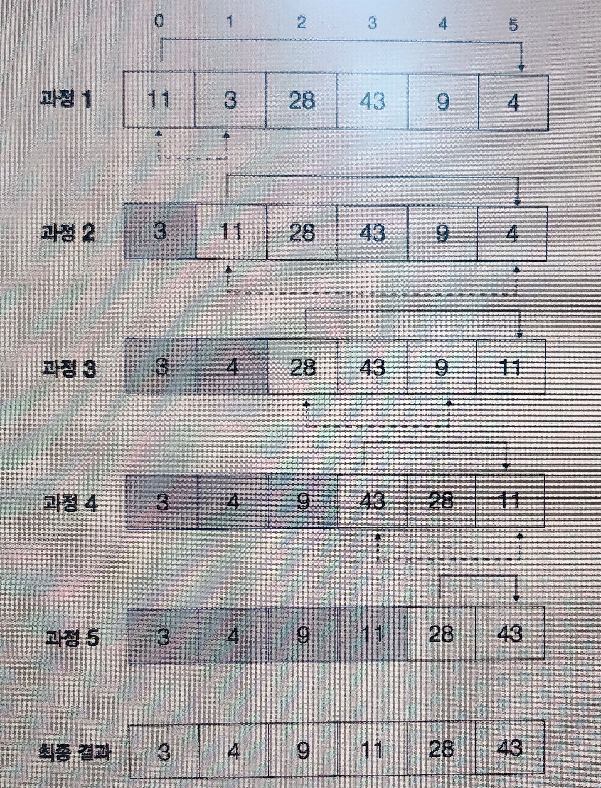

# Bubble sort

- keypoint:
    - front와 end index가 0, 1에서부터 시작한다는게 제일 중요함~!
    - assert code로 테스트하는게 앞으로 코테 준비할 때 매우 중요할듯
    - 뒤에부터 정렬됨
- 특징:
    - best: O(n) // https://www.quora.com/Why-does-bubble-sort-have-O-n-time-complexity-in-the-best-case-performance
    - avg, worst: O(n^2)
    - if 문은 time complexity에 안들어감..!

 


```python
def bubble_sort(seq, reverse=False):
    length = len(seq)
    for i in range(length-1):
        print("{}-iteration, list_of_num: {}".format(i, seq))
        for j in range(length-i-1):
            front = j # key point
            end = j+1 # key point

            if seq[front] < seq[end] and reverse is False: # 오름 차순
                continue
            elif seq[front] > seq[end] and reverse is True: # 내림 차순
                continue
            else:
                # 동시 할당으로 처리
                seq[front], seq[end] = seq[end], seq[front]
    return seq
```


```python
test_case = [11, 3, 28, 43, 9, 4]
bubble_sort(test_case, reverse=False)
```

    0-iteration, list_of_num: [11, 3, 28, 43, 9, 4]
    1-iteration, list_of_num: [3, 11, 28, 9, 4, 43]
    2-iteration, list_of_num: [3, 11, 9, 4, 28, 43]
    3-iteration, list_of_num: [3, 9, 4, 11, 28, 43]
    4-iteration, list_of_num: [3, 4, 9, 11, 28, 43]


    [3, 4, 9, 11, 28, 43]


```python
def test_bubble_sort():
    seq = [4,5,2,1,2,5,14,4]
    assert(bubble_sort(seq) == sorted(seq))
```


```python
test_bubble_sort()
```

    0-iteration, list_of_num: [4, 5, 2, 1, 2, 5, 14, 4]
    1-iteration, list_of_num: [4, 2, 1, 2, 5, 5, 4, 14]
    2-iteration, list_of_num: [2, 1, 2, 4, 5, 4, 5, 14]
    3-iteration, list_of_num: [1, 2, 2, 4, 4, 5, 5, 14]
    4-iteration, list_of_num: [1, 2, 2, 4, 4, 5, 5, 14]
    5-iteration, list_of_num: [1, 2, 2, 4, 4, 5, 5, 14]
    6-iteration, list_of_num: [1, 2, 2, 4, 4, 5, 5, 14]


# Selection sort

- keypoint:
    - 가장 큰 값 혹은 작은값을 뽑아서 정렬
    - fron와 end가 한개씩 이동해서 시작함
    - 앞부터 정렬됨
    - Range를 써서 푸는게 맘편함(i, j의 시작과 끝을 정할 수 있어서)
    - min_val와 min_index를 저장해가면서 했는데, min_val의 경우 공간도 더 차지하고 리스크가 있음. min_index만 사용할 것
- 특징:
    - best, avg, worst: O(n^2) // best(정렬된)의 경우에도 min index가 자기면 자기에게 inner loop에서 대입해서 O(n^2)임
    - unstable (동일 원소끼리도 순서가 바뀜)




```python
def selection_sort(seq):
    length = len(seq)
    for i in range(0, length-1):
        print("{}-iteration, list_of_num: {}".format(i, seq))
        min_index = i
        for j in range(i+1, length):
            if seq[j] < seq[min_index]:
                min_index = j
        seq[i], seq[min_index] = seq[min_index], seq[i]
    return seq        
```


```python
test_case = [11, 3, 28, 43, 9, 4]
selection_sort(test_case)
```

    0-iteration, list_of_num: [11, 3, 28, 43, 9, 4]
    1-iteration, list_of_num: [3, 11, 28, 43, 9, 4]
    2-iteration, list_of_num: [3, 4, 28, 43, 9, 11]
    3-iteration, list_of_num: [3, 4, 9, 43, 28, 11]
    4-iteration, list_of_num: [3, 4, 9, 11, 28, 43]

    [3, 4, 9, 11, 28, 43]


```python
def test_selection_sort():
    seq = [11, 3, 28, 43, 9, 4]
    assert(selection_sort(seq) == sorted(seq))
    print("통과")
    
test_selection_sort()
```

    0-iteration, list_of_num: [11, 3, 28, 43, 9, 4]
    1-iteration, list_of_num: [3, 11, 28, 43, 9, 4]
    2-iteration, list_of_num: [3, 4, 28, 43, 9, 11]
    3-iteration, list_of_num: [3, 4, 9, 43, 28, 11]
    4-iteration, list_of_num: [3, 4, 9, 11, 28, 43]
    통과


# Insertion sort

- keypoint:
    - 이미 정렬되어있으면 O(n)에 바로 끝남
    - 삽입이라서 뒤에서 바로 앞으로 이동시키고 한칸씩 뒤로 밀어버릴것 같지만, 실상은 뒤에서부터 버블 sort처럼 정렬
    - 조건과 반복을 동시에 처리할 수 있는 while문으로 코딩함
- 특징:
    - Best: O(n) / Avg, Worst: O(n^2)


```python
def insertion_sort(seq):
    length = len(seq)
    print("{}-iteration, list_of_num: {}".format(0, seq))
    for i in range(1, length):
        j = i # 뒤에서부터 비교
        while(j > 0 and seq[j] < seq[j-1]):
            seq[j-1], seq[j] = seq[j], seq[j-1]
            j -= 1
        print("{}-iteration, list_of_num: {}".format(i, seq))
    return seq         
```


```python
test_case = [11, 3, 28, 43, 9, 4]
insertion_sort(test_case)
```

    0-iteration, list_of_num: [11, 3, 28, 43, 9, 4]
    1-iteration, list_of_num: [3, 11, 28, 43, 9, 4]
    2-iteration, list_of_num: [3, 11, 28, 43, 9, 4]
    3-iteration, list_of_num: [3, 11, 28, 43, 9, 4]
    4-iteration, list_of_num: [3, 9, 11, 28, 43, 4]
    5-iteration, list_of_num: [3, 4, 9, 11, 28, 43]

    [3, 4, 9, 11, 28, 43]


# gnome sort

- keypoint:
    - 이미 정렬되어있으면 O(n)에 바로 끝남
    - 다 바꾸는게 아니라 조건에 맞는애만 바꿔줌
    - 처음엔 한번만 쭉 훑으면 되는줄 알았는데 그게 아녔음
    - index가 앞으로 갔다가 또 뒤로 쭉 갔다가 조건맞으면 다시 앞으로 갔다가 또 뒤로 쭉 갔다가 왔다갔다함
- 특징:
    - Best: O(n) / Avg, Worst: O(n^2)


```python
def gnome_sort(seq):
    i = 0
    while(i < len(seq)):
        if i == 0 or seq[i-1] < seq[i]:
            i += 1 # 조건 맞으면 앞으로
        else:
            seq[i], seq[i-1] = seq[i-1], seq[i]
            i -= 1 # 조건 안맞으면 뒤로가면서 다시 다 체크~
    return seq
```


```python
test_case = [11, 3, 28, 43, 9, 4]
gnome_sort(test_case)
```


    [3, 4, 9, 11, 28, 43]


# Count sort

- keypoint:
    - 숫자를 담을 추가 메모리 공간이 필요함
    - key, value로 숫자를 리스트로 담아 놓은 다음에 dict에서 min, max를 (여기서 또 시간 듬) 구하고
    - min, max 에 맞게 정렬된 숫자에 대해서 dict에 있으면 꺼내서 list에 extend로 추가하는 형태로 리턴
    - defaultdict이라는 api로 key 값이 없을때 default로 빈 리스트([])가 들어와서 extend에 효과가 없게 함으로써 편하게 구현한걸로 보임
- 특징:
    - 작은 범위의 정수를 정렬할 때 유용함
    - 숫자의 발생 횟수를 계산하는 누적 카운트 사용
    - 숫자 간 간격이 크면 로그 선형제한이 걸려서 비효율적으로 됨
    - 시간복잡도 O(n+k)

------------

#### defaultdict 설명

- defaultdict()는 인자로 주어진 객체(default-factory)의 기본값을 딕셔너리값의 초깃값으로 지정할 수 있다.   
- 숫자, 리스트, 셋등으로 초기화 할 수 있기때문에 여러 용도로 사용할 수 있다.
- 기본적인 작동방식을 살펴보면

```python
>>> from collections import defaultdict    # 외부함수이기 때문에 import 해야한다.
>>> int_dict = defaultdict(int)
>>> int_dict
defaultdict(<class 'int'>, {})                     # 디폴트값이 int인 딕셔너리
```

위와 같이 설정을 하면 값을 지정하지 않은 키는 그 값이 0으로 지정된다.

```python
>>> int_dict['key1']
0
>>> int_dict
defaultdict(<class 'int'>, {'key1': 0}) 
```

키에 명시적으로 값을 지정하게 되면 그 값이 지정된다.

```python
>>> int_dict['key2'] = 'test'
>>> int_dict
defaultdict(<class 'int'>, {'key1': 0, 'key2': 'test'}) 
```

defaultdict라는 말 그대로 처음 키를 지정할 때 값을 주지 않으면 해당 키에 대한 값을 디폴트 값을 지정하겠다는 뜻이다.


출처: https://dongdongfather.tistory.com/69 

-----------


```python
from collections import defaultdict # 초기화 안해줘도 되서 매우 편한듯

def count_sort_dict(seq):
    res, num_to_list_of_nums = [], defaultdict(list)
    for x in seq:
        num_to_list_of_nums[x].append(x)
    min_num_from_key = min(num_to_list_of_nums)
    max_num_from_key = max(num_to_list_of_nums)
    
    for num in range(min_num_from_key, max_num_from_key+1):
        res.extend(num_to_list_of_nums[num])
    return res
```


```python
test_case = [11, 3, 28, 43, 9, 4]
assert count_sort_dict(test_case) == sorted(test_case), 'Test Fail'
```

# Merge ort

- keypoint:
    - 1개가 남을때까지 쪼갠 후 서로 비교 후(divide) 새로운 리스트에 담음(병합)
    - 새로운 리스트는 정렬된 상태이기 때문에 거기서 제일 작은것끼리 서로 비교후 또 새로운 리스트에 담으면 또 정렬된 리스트가 됨, 남는건 concat
    - 둘중 하나가 남아있을떄 loop 도는 제어문과 남은 list에 대해서 concat하는 것, 오름차순을 유지해주는 것등이 키포인트임
    - pop()으로 구현하면 꺼내기 편해서 좋음 (오름차순에서 뒤에있는거 꺼내는거라 큰게 나오는데.. 큰걸로 정렬하고 reverse~)
- 특징:
    - 안정적일뿐 아니라 대규모 데이터에 대해서도 속도가 빠름
    - 공간이 따로 필요하므로 in-place는 아님
    - 공간복잡도는 보통 O(n)이고 linked list의 경우에는 별도의 저장공간이 필요하지 않아서 in-place 가능하고 공간복잡도 O(logn)이 된다
- 시간복잡도:
    - 모두 O(nlogn)


```python
def merge_sort(seq):
    # pop()을 이용한 정렬
    if len(seq) < 2:
        return seq
    
    # ex: seq==[0,1,2,3],   4//2 -> index: 2  0,1  / 2(mid),3 
    # ex: seq==[0,1,2,3,4],   5//2 -> index: 2  0,1  / 2(mid),3, 4 
    
    # divide
    # 아직 쪼갤게 남은 경우, mid 구해서 또 쪼갠다
    mid = len(seq) // 2 
    left, right = seq[:mid], seq[mid:]
    
    # 둘중 하나는 더 길이가 길 수도 있음
    # 오름 차순으로 정렬된 애가 나옴
    left = merge_sort(left)
    right = merge_sort(right)
    
    # conquer
    tmp_seq = []
    while left and right:        
        # 보통 정렬을 오름 차순으로 하니 뒤에 있는게 큰거라고 가정해보자
        # 그럼 tmp_seq에는 작은것부터 넣어줘야한다로 하면 안된다 그 다음에 또 작은게 append되면 순서가 꼬이니까
        # 그러므로 tmp_seq에 큰것부터 넣어줘서 내림차순으로 해준뒤 나중에 reverse로 오름차순 해준다
        if left[-1] <= right[-1]:
            tmp_seq.append(right.pop()) # 큰 것부터 넣는다
        else:
            tmp_seq.append(left.pop())
        print("left: {}, right: {}, result: {}".format(left, right, tmp_seq))

    
    tmp_seq.reverse() # 오름 차순으로 변경
    print("reversed result: {}".format(tmp_seq))
    
    # 남아 있는 left or right는 일단 tmp에 아직 못넣은 애들이니 작은 애들만 남아있음 그러므로 앞에 붙여야됨
    # 둘중에 하나는 지금 다 떨어진 상태임 if list and list의 경우 둘다 값이 있어야만 루프 돌기 때문에
    # list or list 의 경우엔 값이 있는 list가 튀어나오고 둘다 있을 경우 앞에 list가 튀어나옴
    tmp_seq = (left or right) + tmp_seq
    print("final result: {}".format(tmp_seq))
    return tmp_seq   
```


```python
test_case = [11, 3, 28, 43, 9, 4]
assert merge_sort(test_case) == sorted(test_case), 'Test Fail'
```

    left: [3], right: [], result: [28]
    reversed result: [28]
    final result: [3, 28]
    left: [11], right: [3], result: [28]
    left: [], right: [3], result: [28, 11]
    reversed result: [11, 28]
    final result: [3, 11, 28]
    left: [], right: [4], result: [9]
    reversed result: [9]
    final result: [4, 9]
    left: [], right: [4, 9], result: [43]
    reversed result: [43]
    final result: [4, 9, 43]
    left: [3, 11, 28], right: [4, 9], result: [43]
    left: [3, 11], right: [4, 9], result: [43, 28]
    left: [3], right: [4, 9], result: [43, 28, 11]
    left: [3], right: [4], result: [43, 28, 11, 9]
    left: [3], right: [], result: [43, 28, 11, 9, 4]
    reversed result: [4, 9, 11, 28, 43]
    final result: [3, 4, 9, 11, 28, 43]


# Quick sort

- keypoint:
    - pivot 선택이 젤 중요함 (보통은 mid로함)
    - pivot 골라주되, pivot index도 갖고 있어서 자기자신과는 크기 비교하지 않게 한후 작은 그룹 큰 그룹으로 모아넣음
    - 비교할때 왼쪽(작은쪽)에 크기 같은애 넣어주고
    - 마지막엔 before, pivot, after 를 서로 concat해서 리턴해줌
    - 의외로 파이썬 구현은 가장 쉽다.. 와우
    - merge 처럼 다 쪼개고 합칠때 정렬이 아니라, 얘는 피벗으로 정렬하면서 쪼개고 걔네를 그 스텝에서 concat해주기 때문에 뭔가 직관적임
    - 대신에 worst 케이스는 한쪽으로 다 몰려있을테니 더 느려지는거겠고..!
    - cache 사용 안하는 quick sort는 피벗을 좌우 끝중 하나로 잡고 pivot기준으로 left, right index를 서로 만나도록 바꿔가면서 값을 swap해줌
       
- 특징:
    - pivot 선택이 매우 중요함
    - 은근 구현이 간단함, 정렬하면서, 자기자신은 index 저장해놓은걸로 피하면서, 왼쪽, 피벗, 오른쪽 리스트를 concat해서 구현
- 시간복잡도:
    - 최선, 평균: O(nlogn)
    - 최악: O(n^2) (pivot이 최대값 혹은 최소값일때)


```python
def quick_sort_cache(seq):
    if len(seq) < 2:
        return seq
    
    pivot_idx = len(seq) // 2  # pivot 선택이 매우 중요하며 여기선 가운데를 선택
    pivot = seq[pivot_idx]
    before = [x for i, x in enumerate(seq) if i != pivot_idx and x <= pivot]
    after = [x for i, x in enumerate(seq) if i != pivot_idx and pivot < x]
    print("seq: {}, before: {}, pivot: {}, after: {}".format(seq, before, [pivot], after))
    
    result = quick_sort_cache(before) + [pivot] + quick_sort_cache(after)   
    print("result: {}".format(result))
    return result
    
```


```python
test_case = [11, 3, 28, 43, 9, 4]
assert quick_sort_cache(test_case) == sorted(test_case), 'Test Fail'
```

    seq: [11, 3, 28, 43, 9, 4], before: [11, 3, 28, 9, 4], pivot: [43], after: []
    seq: [11, 3, 28, 9, 4], before: [11, 3, 9, 4], pivot: [28], after: []
    seq: [11, 3, 9, 4], before: [3, 4], pivot: [9], after: [11]
    seq: [3, 4], before: [3], pivot: [4], after: []
    result: [3, 4]
    result: [3, 4, 9, 11]
    result: [3, 4, 9, 11, 28]
    result: [3, 4, 9, 11, 28, 43]


# Heap sort

- keypoint:
    - heapq api를 사용해라(?)
       
- 특징:
    - heap 순서 확인 O(logn), n개 순회, 검색 -> O(nlogn)
    - heap 삽입 O(1)
- 시간복잡도:
    - 최선, 평균, 최악: O(nlogn)


```python
import heapq
def heap_sort(seq):
    h = []
    for val in seq:
        heapq.heappush(h, val)
        print("val: ", val)
        print("h: ", h)
    result = [heapq.heappop(h) for i in range(len(h))]
    print("result: ", result)
    return result

```


```python
test_case = [11, 3, 28, 43, 9, 4]
assert heap_sort(test_case) == sorted(test_case), 'Test Fail'
```

    val:  11
    h:  [11]
    val:  3
    h:  [3, 11]
    val:  28
    h:  [3, 11, 28]
    val:  43
    h:  [3, 11, 28, 43]
    val:  9
    h:  [3, 9, 28, 43, 11]
    val:  4
    h:  [3, 9, 4, 43, 11, 28]
    result:  [3, 4, 9, 11, 28, 43]

